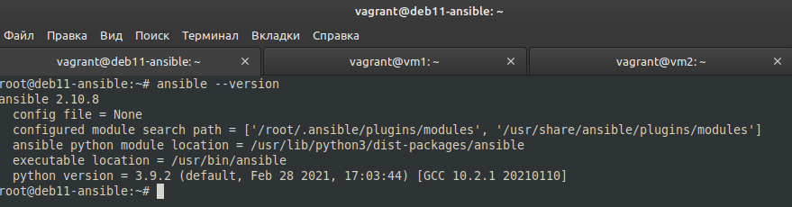
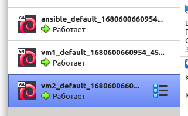
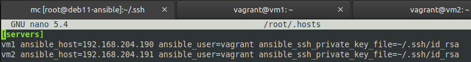
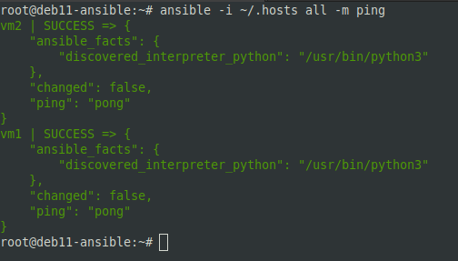
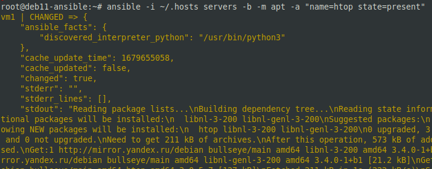
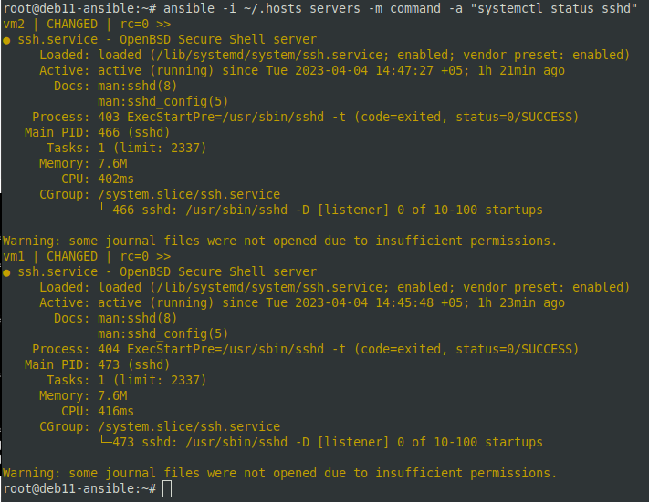
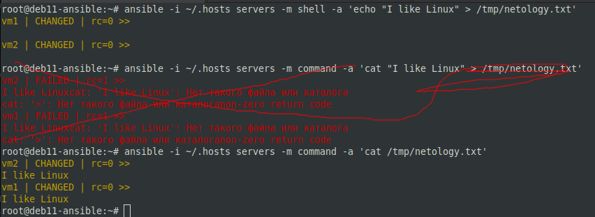

# 07.01. Ansible. Часть 1 - Лебедев Д.С.

## Задание 1.
> Ответьте на вопрос в свободной форме.  
> Какие преимущества даёт подход IAC?

*Ответ:*  
- Скорость, масштабируемость и стандартизация за счет автоматизации при развертывании инфраструктуры.
- Упрощение документации и повышение безопасности путем приведения инфраструктуры к единым стандартам.
- Скорость восстановления инфраструктуры до работоспособного состояния в случае сбоя.

## Задание 2.
> Выполните действия и приложите скриншоты действий.  
> 1. Установите Ansible.
> 2. Настройте управляемые виртуальные машины, не меньше двух.
> 3. Создайте файл inventory. Предлагается использовать файл, размещённый в папке с проектом, а не файл inventory по умолчанию.
> 4. Проверьте доступность хостов с помощью модуля `ping`.

*Ответ:*  
```sh
apt install ansible
ansible --version

ssh-keygen -t rsa
ssh-copy-id vagrant@192.168.204.190
ssh-copy-id vagrant@192.168.204.191

nano ~/.hosts

> [servers]
> vm1 ansible_host=192.168.204.190 ansible_user=vagrant ansible_ssh_private_key_file=~/.ssh/id_rsa
> vm2 ansible_host=192.168.204.191 ansible_user=vagrant ansible_ssh_private_key_file=~/.ssh/id_rsa

ansible -i ~/.hosts all -m ping
```

1  


2  


3  


4  


## Задание 3.
> Ответьте на вопрос в свободной форме.  
> Какая разница между параметрами forks и serial?

*Ответ:*  
- Параметр forks отвечает за количество параллельных процессов, которые Ansible будет использовать при выполнении задач на удаленных хостах. Когда Ansible выполняет задачу на нескольких хостах одновременно, эта опция позволяет задать количество хостов, которые могут быть обработаны одновременно. Например, если значение "forks" равно 5, то Ansible будет выполнять задачи на 5 хостах одновременно.
- Параметр serial задает количество хостов, на которых Ansible будет выполнять задачи последовательно. Если значение "serial" равно 1, то Ansible будет выполнять задачи на каждом хосте последовательно, передвигаясь от одного хоста к другому, пока все задачи не будут выполнены на всех хостах. Если значение "serial" больше 1, то Ansible будет выполнять задачи на заданном количестве хостов одновременно, передвигаясь далее к следующей группе хостов.

## Задание 4.
> В этом задании вы будете работать с Ad-hoc командами.  
> Выполните действия и приложите скриншоты запуска команд.
> 1. Установите на управляемых хостах любой пакет, которого нет.
> 2. Проверьте статус любого, присутствующего на управляемой машине, сервиса.
> 3. Создайте файл с содержимым «I like Linux» по пути `/tmp/netology.txt`.

*Ответ:*  
```sh
root@deb11-ansible:~# ansible -i ~/.hosts servers -b -m apt -a "name=htop state=present"
ansible -i ~/.hosts servers -m command -a "systemctl status sshd"
ansible -i ~/.hosts servers -m shell -a 'echo "I like Linux" > /tmp/netology.txt'
root@deb11-ansible:~# ansible -i ~/.hosts servers -m command -a 'cat /tmp/netology.txt'
```

1  


2  


3  
