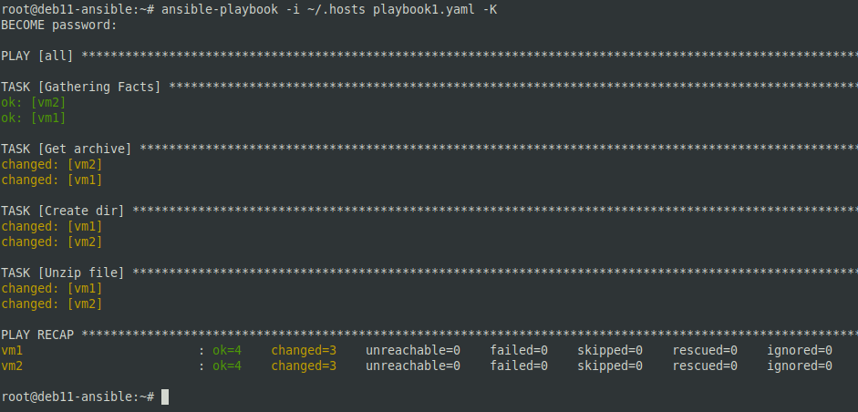
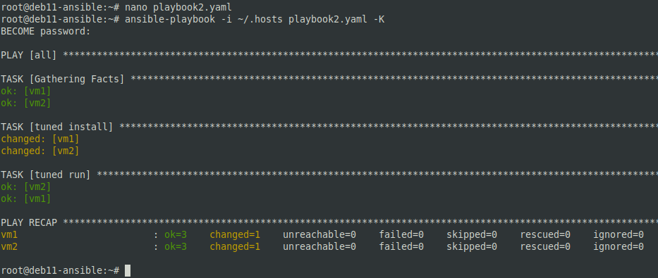
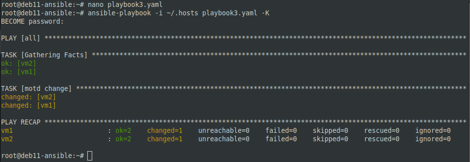
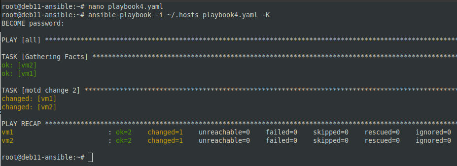
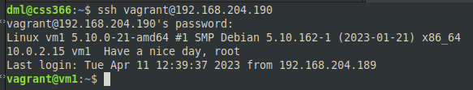
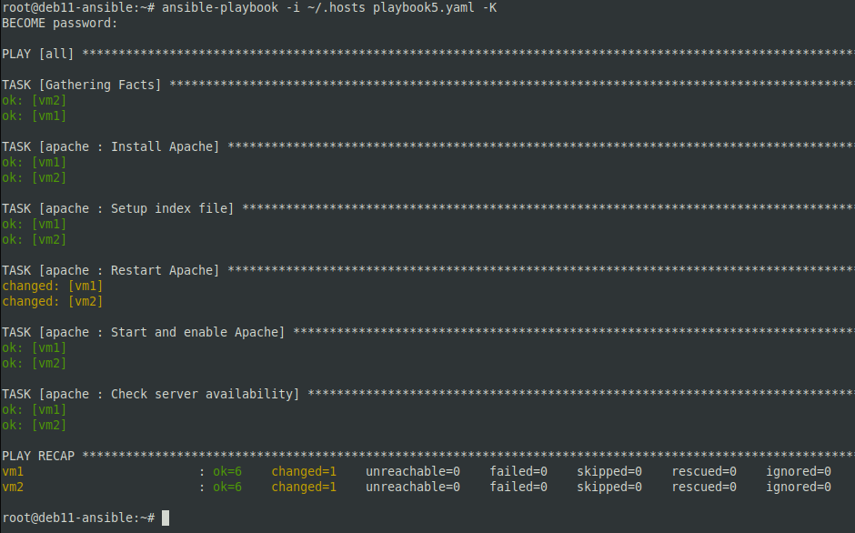
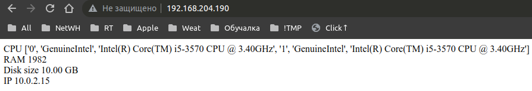

# 07.01. Ansible. Часть 2 - Лебедев Д.С.

## Задание 1.
> **Выполните действия, приложите файлы с плейбуками и вывод выполнения.**  
> Напишите три плейбука. При написании рекомендуем использовать текстовый редактор с подсветкой синтаксиса YAML.  
> Плейбуки должны:
> 1.  Скачать какой-либо архив, создать папку для распаковки и распаковать скаченный архив. Например, можете использовать [официальный сайт](https://kafka.apache.org/downloads) и зеркало Apache Kafka. При этом можно скачать как исходный код, так и бинарные файлы, запакованные в архив — в нашем задании не принципиально.
> 2.  Установить пакет tuned из стандартного репозитория вашей ОС. Запустить его, как демон — конфигурационный файл systemd появится автоматически при установке. Добавить tuned в автозагрузку.
> 3.  Изменить приветствие системы (motd) при входе на любое другое. Пожалуйста, в этом задании используйте переменную для задания приветствия. Переменную можно задавать любым удобным способом.

*Ответ:*  
1  
```sh
nano playbook1.yaml
ansible-playbook -i ~/.hosts playbook1.yaml -K
```

```yaml
---
- hosts: all
  become: true
  tasks:
    - name: "Get archive"
      get_url:
        url: https://downloads.apache.org/kafka/3.4.0/kafka-3.4.0-src.tgz
        dest: /tmp/archive.tgz
        mode: '777'

    - name: "Create dir"
      ansible.builtin.file:
        path: /tmp/kafka
        state: directory
        mode: '777'

    - name: "Unzip file"
      ansible.builtin.unarchive:
        src: /tmp/archive.tgz
        dest: /tmp/kafka
        remote_src: yes
```

  

2  
```yaml
---
- hosts: "all"
  become: true
  tasks:
  - name: "tuned install"
    ansible.builtin.apt:
      name: "tuned"
      state: "latest"
      update_cache: true

  - name: "tuned run"
    service:
      name: tuned
      state: started
      enabled: true
...
```

  

3  
```yaml
---
- hosts: all
  become: true
  tasks:
  - name: "motd change"
    vars:
      motd: "Hello, Netology!"
    copy:
      dest: "/etc/motd"
      content: "{{ motd }}\n"
...
```



## Задание 2.
> **Выполните действия, приложите файлы с модифицированным плейбуком и вывод выполнения.**  
> Модифицируйте плейбук из пункта 3, задания 1. В качестве приветствия он должен установить IP-адрес и hostname управляемого хоста, пожелание хорошего дня системному администратору.

*Ответ:*  
```yaml
---
- hosts: all
  become: true
  tasks:
  - name: "motd change 2"
    copy:
      dest: "/etc/motd"
      content: "{{ ansible_facts.default_ipv4.address }}
      {{ ansible_facts.hostname }}  Have a nice day, {{ ansible_facts.user_id }}\n"
...
```

  



## Задание 3.
> **Выполните действия, приложите архив с ролью и вывод выполнения.**  
> Ознакомьтесь со статьей [bashsible](https://habr.com/ru/post/494738/), сделайте соответствующие выводы и не используйте модули **shell** или **command** при выполнении задания.  
> Создайте плейбук, который будет включать в себя одну, созданную вами роль. Роль должна:
> 1.  Установить веб-сервер Apache на управляемые хосты.
> 2.  Сконфигурировать файл index.html c выводом характеристик для каждого компьютера. Необходимо включить CPU, RAM, величину первого HDD, IP-адрес. Используйте [Ansible facts](https://docs.ansible.com/ansible/latest/playbook_guide/playbooks_vars_facts.html) и [jinja2-template](https://linuxways.net/centos/how-to-use-the-jinja2-template-in-ansible/)
> 3.  Открыть порт 80, если необходимо, запустить сервер и добавить его в автозагрузку.
> 4.  Сделать проверку доступности веб-сайта (ответ 200, модуль uri).

*Ответ:*  
```sh
ansible-galaxy role init apache
nano playbook5.yaml
nano ~/apache/tasks/main.yml
mkdir ~/apache/templates
nano ~/apache/templates/index.conf.j2

scp -r vagrant@192.168.204.189:/tmp/apache /tmp/apache

```

```yaml
---
- hosts: all
  become: true
  roles:
  - name: "install apache"
    role: apache
...
```

```yaml
---
# tasks file for apache
- name: Install apache
  ansible.builtin.apt:
    name: apache2
    state: present
    update_cache: true

- name: Setup index file
  ansible.builtin.template:
    src: index.conf.j2
    dest: /var/www/html/index.html

- name: Restart Apache
  ansible.builtin.service:
    name: apache2
    state: restarted

- name: Start and enable Apache
  ansible.builtin.service:
    name: apache2
    state: started
    enabled: true

- name: Check server availability
  ansible.builtin.uri:
    url: http://localhost
...
```

```html
<html>
CPU {{ ansible_processor }}<br>
RAM {{ ansible_memtotal_mb }}<br>
Disk size {{ ansible_facts['devices']['sda']['size'] }}<br>
IP {{ ansible_facts.default_ipv4.address }}
</html>
```

  



[apache.zip](_attachments/07.012-3_apache.zip)
