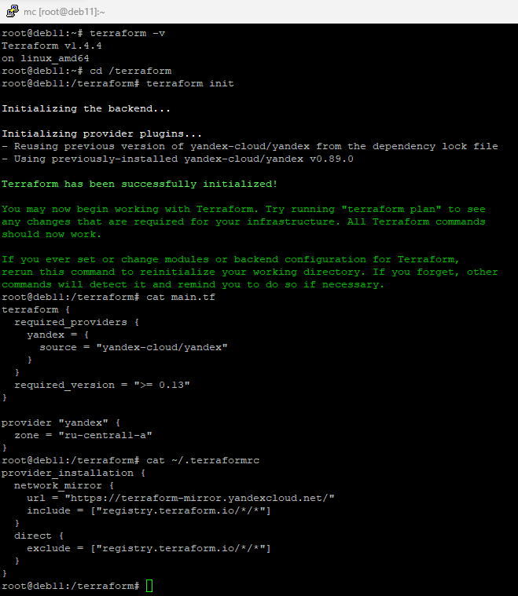

# 07.02. Terraform - Лебедев Д.С.

## Задание 1.
> Ответьте на вопрос в свободной форме.
> Опишите виды подхода к IaC:
> - функциональный;
> - процедурный;
> - интеллектуальный.

*Ответ:*  
- Функциональный (декларативный) подход описывает ожидаемый результат (целевая конфигурация), а не способ его получения.
- Процедурный (императивный) подход - когда прописываются конкретные, последовательно выполняемые команды, указывается то, какие именно изменения требуется внести в конфигурацию.
- Интеллектуальный подход описывает, почему инфраструктура должна быть так сконфигурирована именно так.

## Задание 2.
> Ответьте на вопрос в свободной форме.
> Как вы считаете, в чём преимущество применения Terraform?

*Ответ:*  
При помощи Terraform можно декларативно описать требуемую инфраструктуру и быстро развернуть ее (привести в соответствие с заданной конфигурацией) у любого провайдера, который предоставляет API, без необходимости поднимать сервера вручную и без возможных при таком подходе ошибок. Сами файлы конфигурации содержат человеко-читаемый код, с которым можно работать, применять системы контроля версий и т.д. 

## Задание 3.
> Ответьте на вопрос в свободной форме.
> Какие минусы можно выделить при использовании IaC?

*Ответ:*  
В IaC-подходе используется множество инструментов (дополнительных утилит), каждый со своими нюансами и особенностями, конфигурационные файлы могут быть написаны на разных языках. Развиваются и обновляются они так же по-разному. При этом ошибки могут распространяться сразу на все окружение.  Для изучения этих инструментов и постоянной актуализации навыков требуется большое количество времени.

## Задание 4.
> Выполните действия и приложите скриншоты запуска команд.
> Установите Terraform на компьютерную систему (виртуальную или хостовую), используя лекцию или инструкцию.
> В связи с недоступностью ресурсов для загрузки Terraform на территории РФ, вы можете воспользоваться VPN или использовать зеркало YandexCloud.

*Ответ:*  
```sh
wget https://hashicorp-releases.yandexcloud.net/terraform/1.4.4/terraform_1.4.4_linux_amd64.zip
zcat terraform_1.4.4_linux_amd64.zip > terraform
cp terraform /usr/local/bin
terraform init
```



## Задание 5*.
> Ответьте на вопрос в свободной форме.
> Перечислите основные функции, которые могут использоваться в Terraform.

*Ответ:*  
https://developer.hashicorp.com/terraform/language/functions
[Функции Terraform](https://habr.com/ru/articles/538660/)
- Числовые функции;
- Строковые функции;
- Функции по работе с коллекциями;
- Функции кодирования;
- Функции для работы с файловой системой;
- Функции по работе с датой и временем;
- Функции по работе с IP сетями.