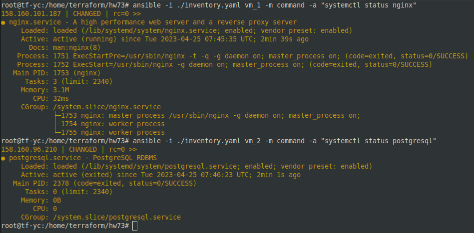

# 07.03. Подъем инфраструктуры в облаке - Лебедев Д.С.

## Задание 1.
> **Выполните действия, приложите скриншот скриптов, скриншот выполненного проекта.**  
> От заказчика получено задание: при помощи Terraform и Ansible собрать виртуальную инфраструктуру и развернуть на ней веб-ресурс.  
> В инфраструктуре нужна одна машина с ПО ОС Linux, двумя ядрами и двумя гигабайтами оперативной памяти.  
> Требуется установить nginx, залить при помощи Ansible конфигурационные файлы nginx и веб-ресурса.  

*Ответ:*  
[main.tf](_attachments/0703_main.tf.txt)  
[meta.txt](_attachments/0703_meta.txt)  
[inventory.yam](_attachments/0703_inventory.yaml.txt)  
[playbook.yaml](_attachments/0703_playbook.yaml.txt)  
[default (nginx)](_attachments/0703_nginx_default.txt)  
[index.html (nginx)](_attachments/0703_index.html.txt)  

  

  

  

## Задание 2*.
> **Выполните действия, приложите скриншот скриптов, скриншот выполненного проекта.**
> 1.  Перестроить инфраструктуру и добавить в неё вторую виртуальную машину.
> 2.  Установить на вторую виртуальную машину базу данных.
> 3.  Выполнить проверку состояния запущенных служб через Ansible.

*Ответ:*  
[main.tf](_attachments/0703-2_main.tf.txt)  
[inventory.yaml](_attachments/0703-2_inventory.yaml.txt)  
[playbook.yaml](_attachments/0703-2_playbook.yaml.txt)  

  

  

  

