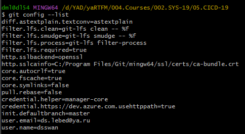
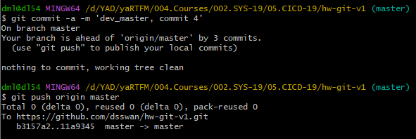
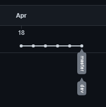
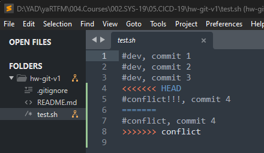
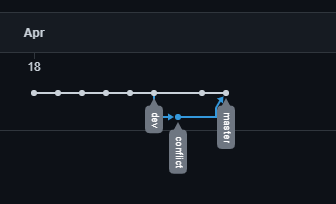

# 08.01. Введение в DevOps. Git - Лебедев Д.С.

https://github.com/dsswan/hw-git-v1.git
Windows Git Bash

## Задание 1.
> **Что нужно сделать:**
> 1.  Зарегистрируйте аккаунт на [GitHub](https://github.com/).  
> 2.  Создайте публичный репозиторий. Обязательно поставьте галочку в поле «Initialize this repository with a README».  
> 3.  Склонируйте репозиторий, используя https протокол `git clone ...`.  
> 4.  Перейдите в каталог с клоном репозитория.  
> 5.  Произведите первоначальную настройку Git, указав своё настоящее имя и email: `git config --global user.name` и `git config --global user.email johndoe@example.com`.  
> 6.  Выполните команду `git status` и запомните результат.  
> 7.  Отредактируйте файл README.md любым удобным способом, переведя файл в состояние Modified.
> 8.  Ещё раз выполните `git status` и продолжайте проверять вывод этой команды после каждого следующего шага.
> 9.  Посмотрите изменения в файле README.md, выполнив команды `git diff` и `git diff --staged`.
> 10.  Переведите файл в состояние staged или, как говорят, добавьте файл в коммит, командой `git add README.md`.
> 11.  Ещё раз выполните команды `git diff` и `git diff --staged`.
> 12.  Теперь можно сделать коммит `git commit -m 'First commit'`.
> 13.  Сделайте `git push origin master`.
> В качестве ответа добавьте ссылку на этот коммит в ваш md-файл с решением.

*Ответ:*  

```sh
git clone https://github.com/dsswan/hw-git-v1.git
git config --list
git status
git commit -a -m 'master, commit 1'
git push origin master
```



[Первый коммит](https://github.com/dsswan/hw-git-v1/commit/db5bc81d8267dfe3810910aa5c6d824bc762ee83)

## Задание 2.
> **Что нужно сделать:**
> 1.  Создайте файл .gitignore (обратите внимание на точку в начале файла) и проверьте его статус сразу после создания.
> 2.  Добавьте файл .gitignore в следующий коммит `git add...`.
> 3.  Напишите правила в этом файле, чтобы игнорировать любые файлы `.pyc`, а также все файлы в директории `cache`.
> 4.  Сделайте коммит и пуш.
> В качестве ответа добавьте ссылку на этот коммит в ваш md-файл с решением.

*Ответ:*  

```sh
git status
git add .gitignore
git commit -a -m 'master, commit 2 gitignore'
git push origin master
```

https://github.com/dsswan/hw-git-v1/commit/b3157a2757f34315ee8fc6f2d864e9a340d0c69d

## Задание 3.
> **Что нужно сделать:**
> 1.  Создайте новую ветку dev и переключитесь на неё.
> 2.  Создайте файл test.sh с произвольным содержимым.
> 3.  Сделайте несколько коммитов и пушей, имитируя активную работу над этим файлом.
> 4.  Сделайте мердж этой ветки в основную. Сначала нужно переключиться на неё, а потом вызывать `git merge`.
> 5.  Сделайте коммит и пуш.
> В качестве ответа прикрепите ссылку на граф коммитов [https://github.com/ваш-логин/ваш-репозиторий/network](https://github.com/%D0%B2%D0%B0%D1%88-%D0%BB%D0%BE%D0%B3%D0%B8%D0%BD/%D0%B2%D0%B0%D1%88-%D1%80%D0%B5%D0%BF%D0%BE%D0%B7%D0%B8%D1%82%D0%BE%D1%80%D0%B8%D0%B9/network) в ваш md-файл с решением.

*Ответ:*  
```sh
git checkout -b dev
git branch -v

git add test.sh
git commit -m 'dev, commit 1'
git push origin dev

git commit -a -m 'dev, commit 2'
git push origin dev

git commit -a -m 'dev, commit 3'
git push origin dev

git checkout master
git merge dev
~~git commit -a -m 'dev_master, commit 4'~~
git push origin master
```

Последний коммит в ветке `master` не прошел, файл `test.sh` просто копируется из ветки `dev` в ветку `master` с последним коммитом ветки `dev`. Это логично по своему, ведь по заданию ветка `master` ничего не знает об этом файле до самого слияния.  





https://github.com/dsswan/hw-git-v1/network

## Задание 4*.
> Сэмулируем конфликт. Перед выполнением изучите с [документацию](https://git-scm.com/book/ru/v2/%D0%98%D0%BD%D1%81%D1%82%D1%80%D1%83%D0%BC%D0%B5%D0%BD%D1%82%D1%8B-Git-%D0%9F%D1%80%D0%BE%D0%B4%D0%B2%D0%B8%D0%BD%D1%83%D1%82%D0%BE%D0%B5-%D1%81%D0%BB%D0%B8%D1%8F%D0%BD%D0%B8%D0%B5).
> **Что нужно сделать:**
> 1.  Создайте ветку conflict и переключитесь на неё.
> 2.  Внесите изменения в файл test.sh.
> 3.  Сделайте коммит и пуш.
> 4.  Переключитесь на основную ветку.
> 5.  Измените ту же самую строчку в файле test.sh.
> 6.  Сделайте коммит и пуш.
> 7.  Сделайте мердж ветки conflict в основную ветку и решите конфликт так, чтобы в результате в файле оказался код из ветки conflict.
> В качестве ответа на задание прикрепите ссылку на граф коммитов [https://github.com/ваш-логин/ваш-репозиторий/network](https://github.com/%D0%B2%D0%B0%D1%88-%D0%BB%D0%BE%D0%B3%D0%B8%D0%BD/%D0%B2%D0%B0%D1%88-%D1%80%D0%B5%D0%BF%D0%BE%D0%B7%D0%B8%D1%82%D0%BE%D1%80%D0%B8%D0%B9/network) в ваш md-файл с решением.

*Ответ:*  

```sh
git checkout -b conflict
git commit -a -m 'conflict, commit 4'
git push origin conflict

git checkout master
git commit -a -m 'conflict!!!, commit 4'
git push origin master

git merge conflict

git commit -a -m 'conflict ok, commit 5'
git push origin master
```

  



https://github.com/dsswan/hw-git-v1/network