# 08.02. Что такое DevOps. CI/CD - Лебедев Д.С.

## Задание 1
> **Что нужно сделать:**
> 1.  Установите себе jenkins по инструкции из лекции или любым другим способом из официальной документации. Использовать Docker в этом задании нежелательно.
> 2.  Установите на машину с jenkins [golang](https://golang.org/doc/install).
> 3.  Используя свой аккаунт на GitHub, сделайте себе форк [репозитория](https://github.com/netology-code/sdvps-materials.git). В этом же репозитории находится [дополнительный материал для выполнения ДЗ](https://github.com/netology-code/sdvps-materials/blob/main/CICD/8.2-hw.md).
> 4.  Создайте в jenkins Freestyle Project, подключите получившийся репозиторий к нему и произведите запуск тестов и сборку проекта `go test .` и `docker build .`.
> В качестве ответа пришлите скриншоты с настройками проекта и результатами выполнения сборки.

*Ответ:*  

1. Установка из [Vagrant](_attachments/vagrantfile82.txt)

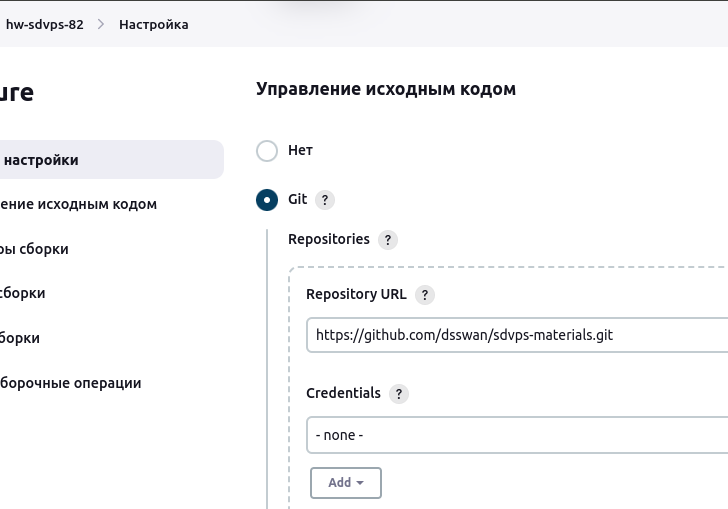  
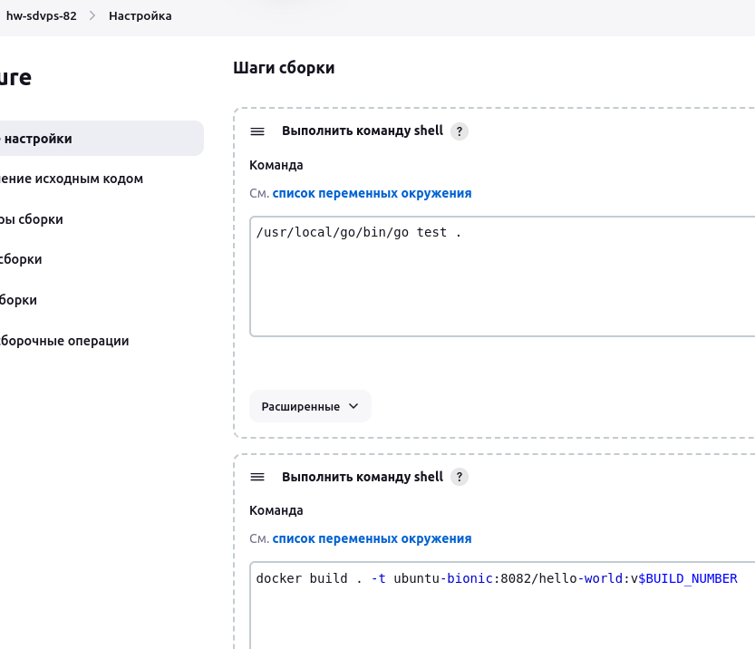  

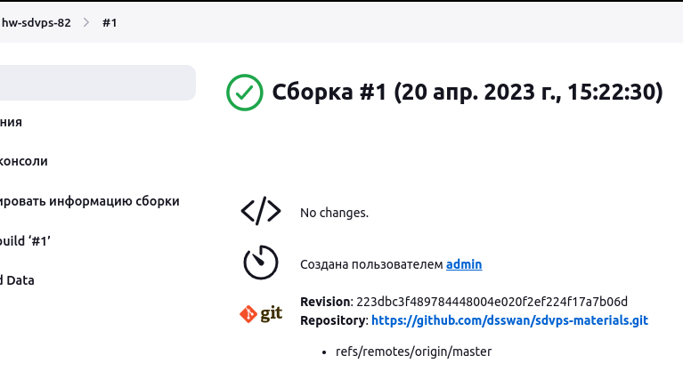  
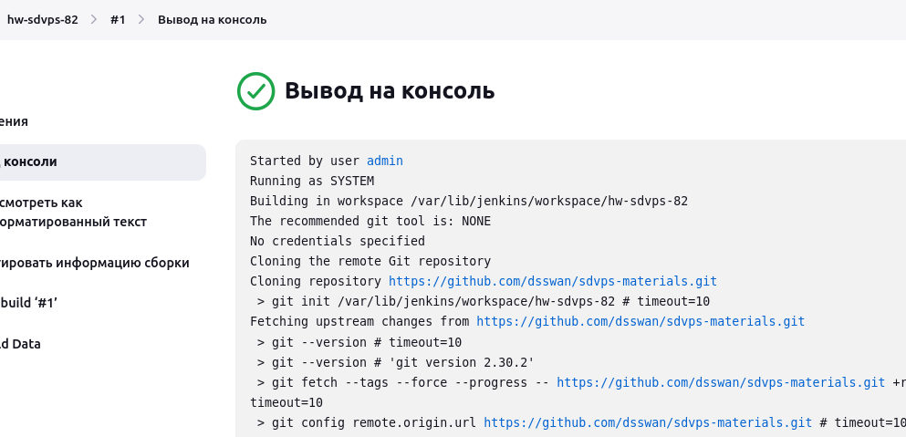  

## Задание 2
> **Что нужно сделать:**
> 1.  Создайте новый проект pipeline.
> 2.  Перепишите сборку из задания 1 на declarative в виде кода.
> В качестве ответа пришлите скриншоты с настройками проекта и результатами выполнения сборки.

*Ответ:*  

```sh
pipeline {
 agent any
 stages {
  stage('Git') {
   steps {git 'https://github.com/dsswan/sdvps-materials.git'}
  }
  stage('Test') {
   steps {
    sh '/usr/local/go/bin/go test .'
   }
  }
  stage('Build') {
   steps {
    sh 'docker build . -t ubuntu-bionic:8082/hello-world:v$BUILD_NUMBER'
   }
  }
 }
}
```

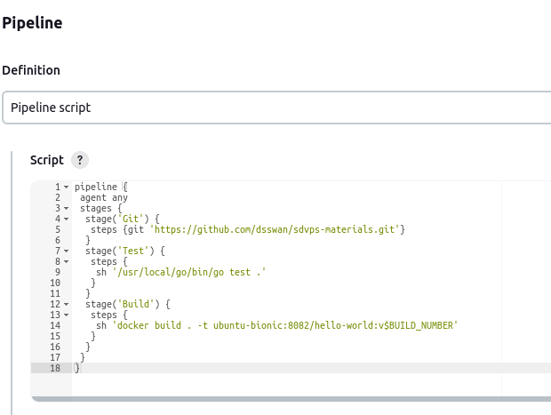  

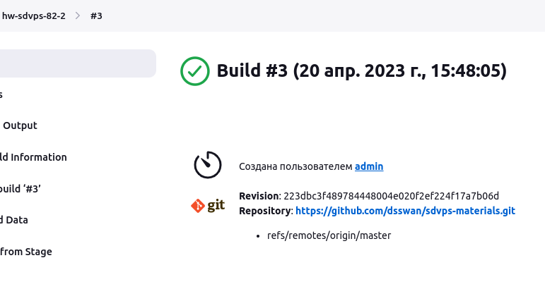

## Задание 3
> **Что нужно сделать:**
> 1.  Установите на машину Nexus.
> 2.  Создайте raw-hosted репозиторий.
> 3.  Измените pipeline так, чтобы вместо Docker-образа собирался бинарный go-файл. Команду можно скопировать из Dockerfile.
> 4.  Загрузите файл в репозиторий с помощью jenkins.
> В качестве ответа пришлите скриншоты с настройками проекта и результатами выполнения сборки.

*Ответ:*  

```sh
pipeline {
 agent any
 stages {
  stage('Git') {
   steps {git 'https://github.com/dsswan/sdvps-materials.git'}
  }
  stage('Test') {
   steps {
    sh '/usr/local/go/bin/go test .'
   }
  }
  stage('Build') {
   steps {
    sh '/usr/local/go/bin/go build .'
   }
  }
  stage('Push') {
   steps {
    sh 'curl -u admin:admin ubuntu-bionic:8081/repository/my_repo_go/ --upload-file sdvps-materials -v'  }
  }
 }
}
```

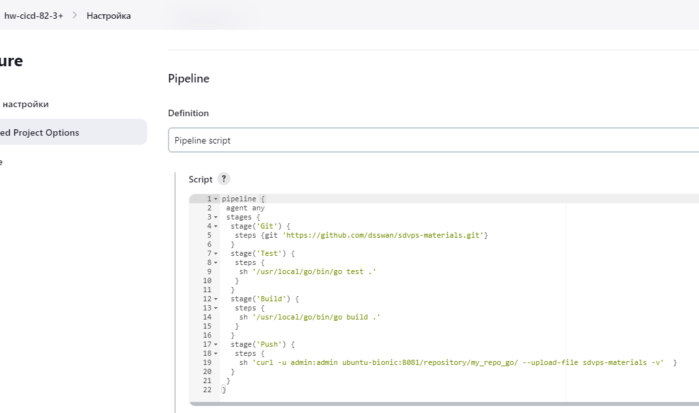  

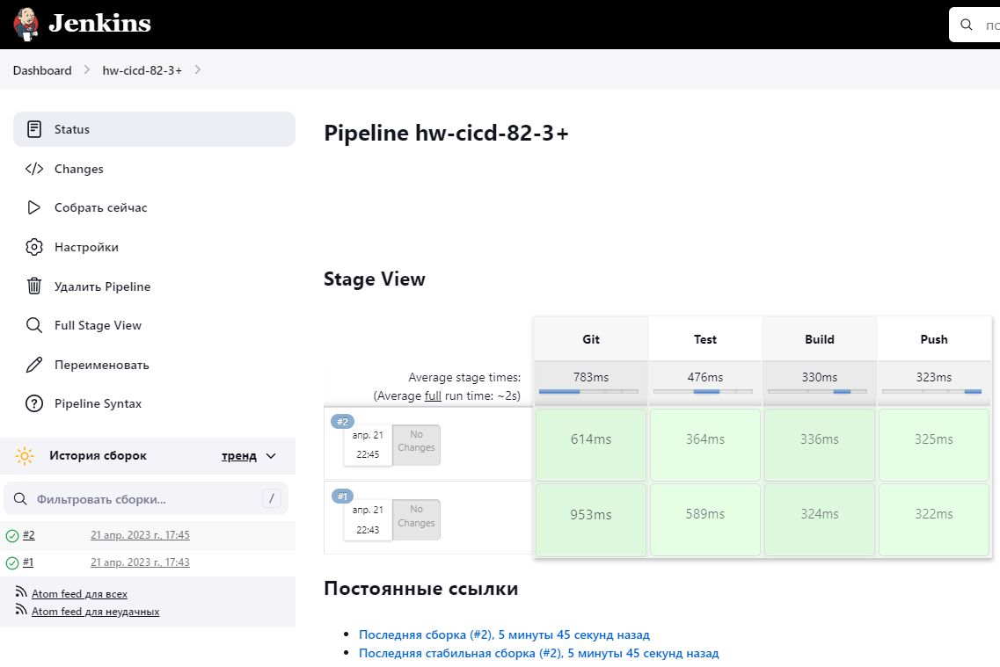  

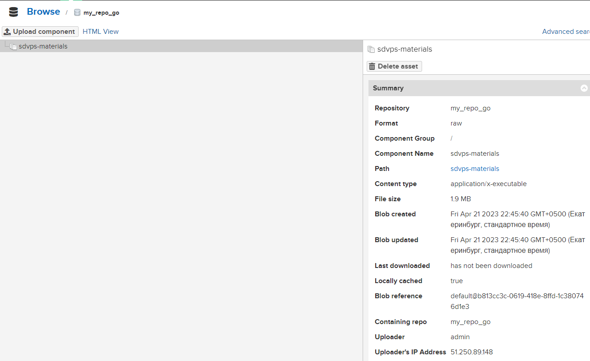  


### Задание 4*
> Придумайте способ версионировать приложение, чтобы каждый следующий запуск сборки присваивал имени файла новую версию. Таким образом, в репозитории Nexus будет храниться история релизов.
> Подсказка: используйте переменную BUILD_NUMBER.
> В качестве ответа пришлите скриншоты с настройками проекта и результатами выполнения сборки.

*Ответ:*  
```sh
pipeline {
 agent any
 stages {
  stage('Git') {
   steps {git 'https://github.com/dsswan/sdvps-materials.git'}
  }
  stage('Test') {
   steps {
    sh '/usr/local/go/bin/go test .'
   }
  }
  stage('Build') {
   steps {
    sh '/usr/local/go/bin/go build .'
   }
  }
  stage('Push') {
   steps {
    sh 'curl -u admin:admin ubuntu-bionic:8081/repository/my_repo_go/sdvps-materials:v$BUILD_NUMBER --upload-file sdvps-materials -v'  }
  }
 }
}
```

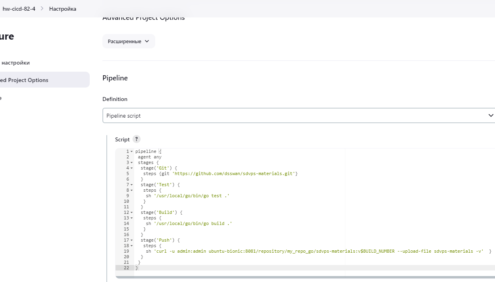  

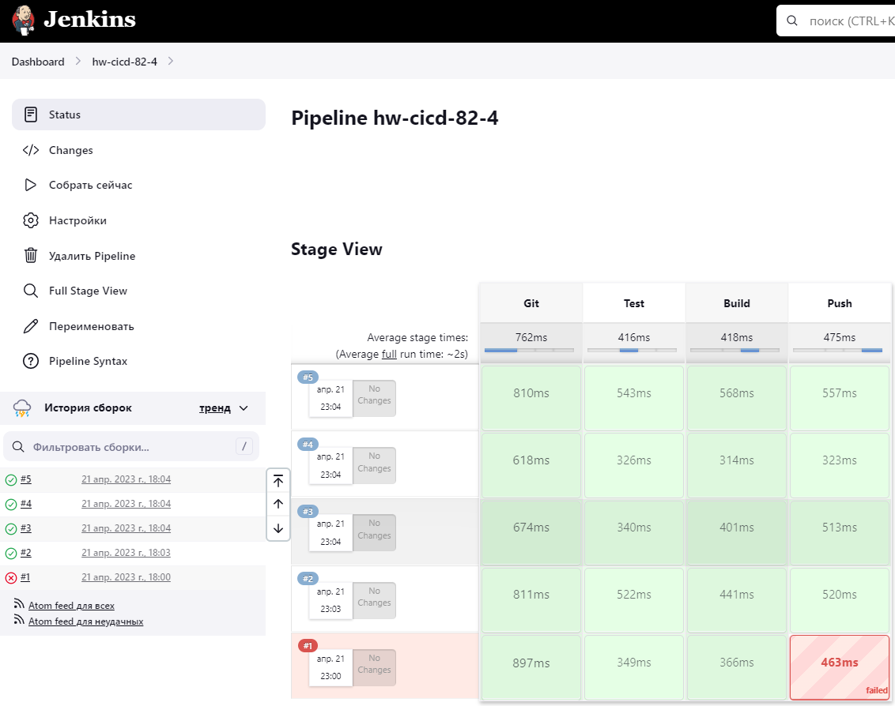  

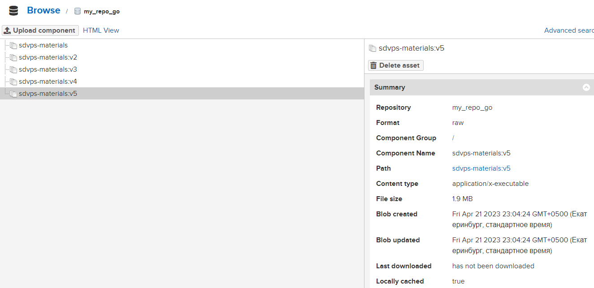